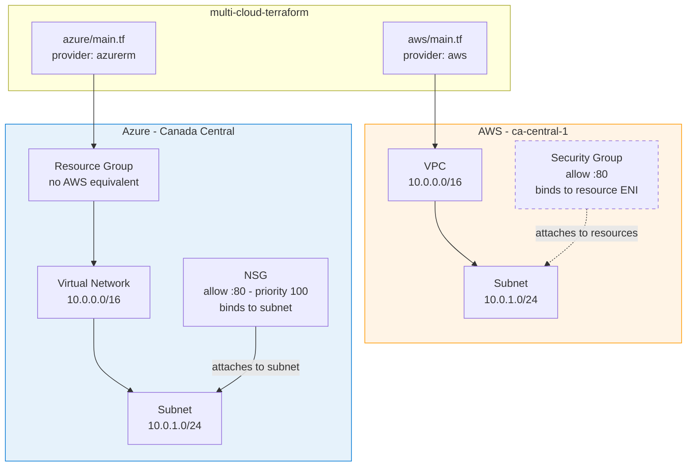

# Multi-Cloud Infrastructure with Terraform

**One codebase. Two clouds. Identical network architecture.**

The same network foundation deployed to AWS and Azure — built to document exactly where the two clouds stop being interchangeable.

## Architecture

**The dashed line is the point.** In AWS the security group binds to a resource. In Azure the NSG binds to the subnet — it governs everything inside by default. Same rule, different blast radius.

## The Mapping

| Layer | AWS | Azure |
|---|---|---|
| Container | *no equivalent* | **Resource Group** |
| Network | **VPC** — 10.0.0.0/16 | **Virtual Network** — 10.0.0.0/16 |
| Subnet | **Subnet** — 10.0.1.0/24 | **Subnet** — 10.0.1.0/24 |
| Firewall | **Security Group** — HTTP :80 | **NSG** — HTTP :80, priority 100 |
| Region | ca-central-1 | Canada Central |

Both sides deployed and verified in their respective consoles.

## Where The Clouds Actually Diverge

The mapping table makes it look like find-and-replace. It isn't.

**1. Azure mandates Resource Groups.**
Not an organisational preference — a lifecycle boundary. It changes how deletes cascade, how RBAC scopes, and how cost rolls up. AWS has no equivalent.

**2. NSG rules are priority-ordered and support explicit denies. Security groups do neither.**
AWS security groups are pure allow-lists with no precedence. Azure evaluates by priority, first match wins. **A rule-for-rule port of a non-trivial security group will silently behave differently** — validated green, wrong in production. That is the migration trap, and it does not surface in a mapping table.

**3. The attachment model differs.**
AWS binds a security group to a resource's ENI. Azure binds an NSG to a subnet or NIC. Same intent, different blast radius.

These are the things you only learn by deploying both.

## Structure

    multi-cloud-terraform/
    ├── aws/          # aws provider — VPC, subnet, security group
    ├── azure/        # azurerm provider — RG, VNet, subnet, NSG
    └── docs/         # WHY.md, ARCHITECTURE.md

Each cloud has an isolated provider config and state, so they deploy independently:

    cd aws   && terraform init && terraform apply
    cd azure && terraform init && terraform apply

**States are isolated on purpose.** A failure on one side cannot corrupt or block the other — the same reason wave-based migrations sequence sites rather than running them in parallel: contain the blast radius, validate, then proceed.

## Engineering Notes

**State is gitignored.** State files contain resource IDs and subscription identifiers — they never belong in version control. Production would use remote state: S3 + DynamoDB locking on AWS, or an Azure Storage Account with blob leasing.

**Free-tier by design.** No compute — networks, subnets, and firewall rules cost nothing on either

cd ~/Desktop/multi-cloud-terraform
cat > README.md << 'ENDOFFILE'
# Multi-Cloud Infrastructure with Terraform

**One codebase. Two clouds. Identical network architecture.**

The same network foundation deployed to AWS and Azure — built to document exactly where the two clouds stop being interchangeable.

## Architecture

**The dashed line is the point.** In AWS the security group binds to a resource. In Azure the NSG binds to the subnet — it governs everything inside by default. Same rule, different blast radius.

## The Mapping

| Layer | AWS | Azure |
|---|---|---|
| Container | *no equivalent* | **Resource Group** |
| Network | **VPC** — 10.0.0.0/16 | **Virtual Network** — 10.0.0.0/16 |
| Subnet | **Subnet** — 10.0.1.0/24 | **Subnet** — 10.0.1.0/24 |
| Firewall | **Security Group** — HTTP :80 | **NSG** — HTTP :80, priority 100 |
| Region | ca-central-1 | Canada Central |

Both sides deployed and verified in their respective consoles.

## Where The Clouds Actually Diverge

The mapping table makes it look like find-and-replace. It isn't.

**1. Azure mandates Resource Groups.**
Not an organisational preference — a lifecycle boundary. It changes how deletes cascade, how RBAC scopes, and how cost rolls up. AWS has no equivalent.

**2. NSG rules are priority-ordered and support explicit denies. Security groups do neither.**
AWS security groups are pure allow-lists with no precedence. Azure evaluates by priority, first match wins. **A rule-for-rule port of a non-trivial security group will silently behave differently** — validated green, wrong in production. That is the migration trap, and it does not surface in a mapping table.

**3. The attachment model differs.**
AWS binds a security group to a resource's ENI. Azure binds an NSG to a subnet or NIC. Same intent, different blast radius.

These are the things you only learn by deploying both.

## Structure

    multi-cloud-terraform/
    ├── aws/          # aws provider — VPC, subnet, security group
    ├── azure/        # azurerm provider — RG, VNet, subnet, NSG
    └── docs/         # WHY.md, ARCHITECTURE.md

Each cloud has an isolated provider config and state, so they deploy independently:

    cd aws   && terraform init && terraform apply
    cd azure && terraform init && terraform apply

**States are isolated on purpose.** A failure on one side cannot corrupt or block the other — the same reason wave-based migrations sequence sites rather than running them in parallel: contain the blast radius, validate, then proceed.

## Engineering Notes

**State is gitignored.** State files contain resource IDs and subscription identifiers — they never belong in version control. Production would use remote state: S3 + DynamoDB locking on AWS, or an Azure Storage Account with blob leasing.

**Free-tier by design.** No compute — networks, subnets, and firewall rules cost nothing on either cloud. Teardown runs after every apply regardless; the habit is what protects you when the next project does have a VM in it.

**Why identical CIDRs.** 10.0.0.0/16 on both sides is deliberate. These networks never peer, so there is no conflict — and holding the addressing constant means any behavioural difference is attributable to the provider, not the design. It is the control variable.

**Scope, honestly:** a network foundation, not a production landing zone. No compute, no remote backend, no CI/CD gating. That is a choice, not an omission — adding them would introduce cost and noise without changing what this project answers.

## Next

- [ ] Remote state backends (S3 / Azure Storage) with locking
- [ ] Shared modules — traded off deliberately, since abstraction would hide the divergences this documents
- [ ] CI/CD: plan on PR, gated apply on merge

**Docs:** [Why this exists](docs/WHY.md) · [Architecture detail](docs/ARCHITECTURE.md)

**Stack:** Terraform · HCL · AWS · Azure
