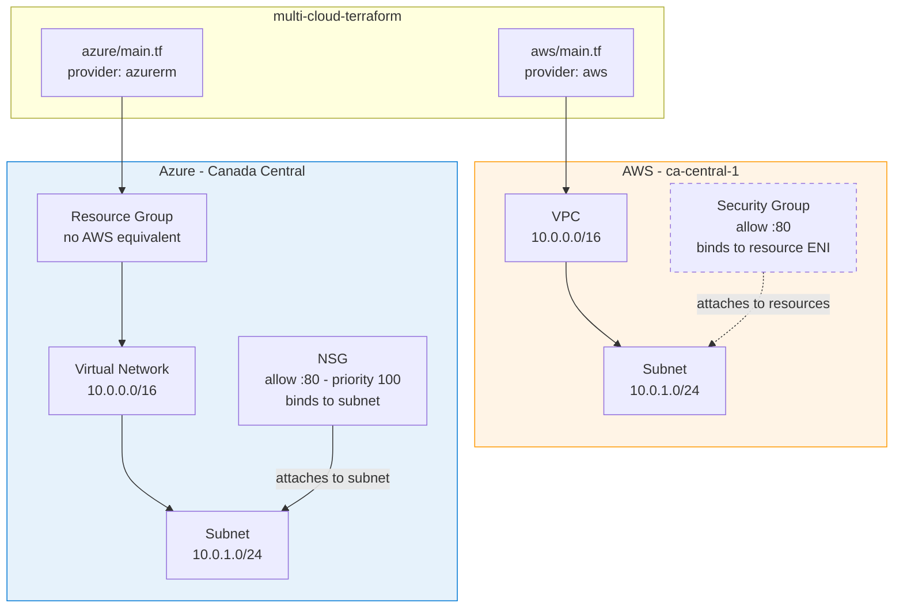

# Architecture

One Terraform codebase, two providers, two isolated states. The same logical architecture — deliberately identical CIDR ranges — so the only variable is the cloud.

## Reading The Diagram

**The solid arrows are the story.** Azure's Resource Group sits above the network — everything descends from it, because in Azure nothing exists outside one. AWS has no equivalent box; the VPC is the top of the tree.

**The dashed line is the trap.** In AWS the security group attaches to resources — drawn dashed because nothing enforces it at the subnet boundary. In Azure the NSG attaches to the subnet itself, so it governs everything inside by default. Same rule, different blast radius.

## Deployment Topology

| | AWS | Azure |
|---|---|---|
| Provider | hashicorp/aws ~> 5.0 | hashicorp/azurerm ~> 3.0 |
| Auth | AWS CLI credentials | az login |
| State | local, isolated | local, isolated |
| Region | ca-central-1 | Canada Central |
| Resources | 3 | 5 |

**States are isolated on purpose.** Each cloud plans and applies independently — a failure on one side cannot corrupt or block the other. That separation is the same reason wave-based migrations sequence sites rather than running them in parallel: contain the blast radius, validate, then proceed.

## Why Identical CIDRs

10.0.0.0/16 on both sides is deliberate. These networks never peer, so there is no conflict — and holding the addressing constant means any behavioural difference between the clouds is attributable to the provider, not the design. It is the control variable.

## Known Gaps

- **Local state.** Fine for a single operator, wrong for a team. Remote state with locking (S3 + DynamoDB / Azure Storage blob lease) is the first thing to add.
- **No compute.** Nothing to route to. That is scope, not oversight — a VM would add cost without changing what this answers.
- **Duplicated resource definitions.** A shared module layer would reduce per-cloud repetition, at the cost of an abstraction that hides exactly the divergences this project exists to document. Deliberate tradeoff, revisited next iteration.
